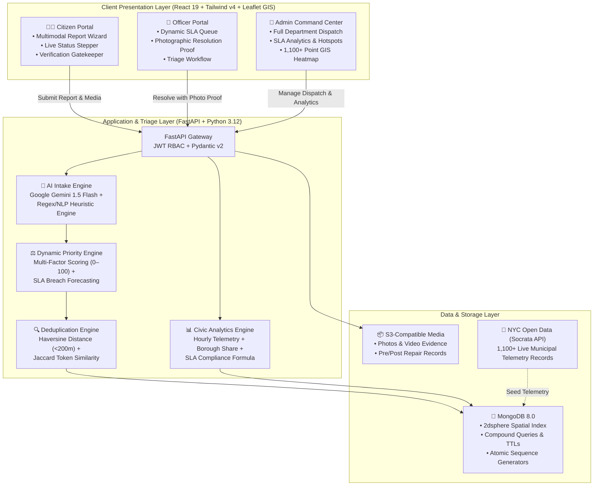

# 🏛️ CivicPortal — Smart Civic Complaint & Issue Management System

DPA Hackathon 2026 · Case Study 1 · Full-stack: FastAPI + MongoDB + React 19 + Tailwind v4.

---

## ⚡ Quick Start (Docker — Recommended)

### Prerequisites
- [Docker Desktop](https://www.docker.com/products/docker-desktop/) installed and running
- Ports **8000** and **5173** must be free

### Step 1 — Copy env files
```bash
cp .env.example .env
cp frontend/.env.example frontend/.env
```

### Step 2 — Build and start everything
```bash
docker compose up --build
```
First build takes ~3–5 min (downloads images + installs deps). Subsequent starts are instant:
```bash
docker compose up          # start without rebuilding
docker compose down        # stop all services
docker compose down -v     # stop AND wipe database (WARNING: deletes all data)
```

### Step 3 — Access the app

| Service | URL |
|---|---|
| **Frontend (UI)** | http://localhost:5173 |
| **Backend API** | http://localhost:8000 |
| **Swagger / API Docs** | http://localhost:8000/docs |
| **Health check** | http://localhost:8000/health |

### Step 4 — Seed demo users & default departments
Populate the database with all roles (Admin, Officers, Citizens) and demo accounts:
```bash
# Inside Docker:
docker compose exec backend python seed.py
```
> 💡 This bootstraps the system admin (`admin@city.gov` / `Admin@1234`), 5 department officers, 3 citizens, and default municipal departments!

### Step 5 — Seed 1,000+ Authentic NYC 311 Records (NYC Open Data)

To test the system at real municipal scale with **1,000+ live NYC 311 complaints**, real GPS coordinates across all 5 boroughs, agency dispatch workflows, and duplicate clustering:

```bash
# Inside Docker (recommended on any laptop):
docker compose exec backend python seed_nyc311_full.py --limit 1000 --batch-size 250

# Or locally (if running outside Docker):
cd backend
python seed_nyc311_full.py --limit 1000 --batch-size 250
```

> 🗽 **What this fetches & processes:**
> - Queries the official **NYC Open Data Socrata API** (`erm2-nwe9.json`) in batches.
> - Ingests 1,000 real civic incident reports across **Manhattan, Brooklyn, Queens, The Bronx, and Staten Island**.
> - Preserves authentic **agencies (NYPD, DSNY, DOT, DEP, DOB)**, descriptors, street addresses, and resolution notes.
> - Automatically runs our **4-step geospatial & NLP duplicate clustering algorithm**.
> - Automatically calculates **0–100 explainable priority scores** with SLA breach forecasting.

### Step 6 — Setup Google Gemini AI (Optional / Recommended)

CivicPortal includes native integration with **Google Gemini 1.5 Flash** for generative category detection, urgency classification, and executive summarization:

1. Obtain a free Gemini API key from [Google AI Studio](https://aistudio.google.com/).
2. Open your `.env` file in the project root and add your key:
   ```env
   GEMINI_API_KEY=AIzaSy...
   ```
3. Restart the backend container:
   ```bash
   docker compose restart backend
   ```
> 💡 **Graceful Offline Fallback:** If `GEMINI_API_KEY` is not provided or quota is exceeded, the system automatically and transparently falls back to our high-speed local rule-based NLP engine (`ai_extract.py`), ensuring 100% uninterrupted operation on any laptop.

### View logs per service
```bash
docker compose logs backend        --tail=50 -f
docker compose logs civic-frontend --tail=50 -f
docker compose logs mongo          --tail=20
```

---

## 🛠️ Manual Setup (No Docker)

### Start MongoDB separately
```bash
# Easiest: Docker just for Mongo
docker run -d --name civic-mongo -p 27017:27017 mongo:7
```

### Backend
```bash
cd backend

# Create and activate virtual environment
python -m venv .venv
.venv\Scripts\activate        # Windows
# source .venv/bin/activate   # Mac/Linux

# Install all dependencies (FastAPI, Motor, rapidfuzz, etc.)
pip install -r requirements.txt

# Configure environment
copy ..\.env.example .env     # Windows
# cp ../.env.example .env     # Mac/Linux

# Start the server
uvicorn app.main:app --reload --host 0.0.0.0 --port 8000
```

### Frontend
```bash
# Open a new terminal
cd frontend

bun install          # or: npm install
bun dev              # or: npm run dev
```

Frontend → **http://localhost:5173** · Backend → **http://localhost:8000**

---

## 🧪 Manual Testing Guide

### As a Citizen

**Register:**
1. Go to http://localhost:5173/register
2. Click the **Citizen** role card
3. Fill name, email, password (min 6 chars), click Create Account
4. You'll land on the citizen dashboard

**Submit a complaint:**
1. Click **Submit Issue** in the left sidebar
2. Click a category card (e.g. **Streetlight**)
3. Type in the description field — try:
   > *"The streetlight near Gate 3 has been broken for almost a week. The road is completely dark at night, very unsafe for children."*
4. Wait ~1.5 seconds → an amber **AI Suggestion chip** will appear:
   - *"AI suggests: Streetlight · HIGH Priority · 85% confident"*
   - Click **Apply** to auto-select that category, or **✕** to dismiss
5. Click **Use my location** (browser will ask permission) or type lat/lng manually
6. Click **Submit Complaint**
7. ✅ Success screen shows: Complaint ID, Priority badge, AI summary, and duplicate warning if flagged

**Track your complaint:**
1. Click **My Complaints** in the sidebar
2. Use tabs to filter: All / Open / In Progress / Resolved
3. Click a complaint row to expand it → shows the **4-step status stepper** + audit history timeline
4. Type a comment and click Send

---

### As an Officer

**Register:**
1. Go to http://localhost:5173/register
2. Click the **Officer** role card
3. Fill name, email, password
4. Select your department from the dropdown (loaded from the API)
5. Create Account → land on officer dashboard

**View your queue:**
1. Dashboard shows: Priority Queue (top complaints by score) + SLA Warnings
2. Click **My Queue** in the sidebar
3. Complaints are sorted by priority (Critical first, red left border)
4. Each card shows the **SLA timer** (e.g. "Due in 14h" or "OVERDUE 3h" in red)

**Update a complaint status:**
1. On a complaint card, use the **Status dropdown** (Assigned → In Progress → Resolved)
2. Change the status → a toast notification confirms the update
3. Add an official comment in the text field → click Send

> **Note:** Officers only see complaints assigned to their department.

---

### As an Admin

**Login** with the bootstrapped admin account.

**Dashboard:**
- 6 KPI cards: Total Complaints, Unresolved, Unassigned, SLA Compliance %, Avg Resolution, Duplicates
- Two bar charts: by Status / by Category (pure SVG, no external library)
- 30-day trend line chart: Filed vs Resolved per day
- Top Hotspots (geographic clusters) + SLA Performance card

**Assign a complaint:**
1. Go to **All Complaints**
2. Click any table row to expand it
3. In the expanded section → Department dropdown → select a dept or choose **"Auto (by category)"**
4. Click **Assign** → toast confirms → row updates instantly

**Delete a complaint:**
1. Click the 🗑️ icon in the row's Actions column
2. A **confirmation modal** appears (no browser popup)
3. Click **Confirm Delete** → toast confirms, row removed

**Departments:**
1. Go to **Departments** in sidebar → see all departments as cards
2. Click **Edit** on any card → modal opens with editable fields
3. Click **Add Department** → fill form → Save

**Analytics:**
1. Go to **Analytics** in sidebar
2. Toggle **SLA threshold**: 48h / 72h / 96h → all numbers update
3. See the **circular SLA compliance ring** (SVG stroke-dasharray technique)
4. Scroll down for **Aging Complaints** (color coded: red >96h, orange >72h, amber >48h)

---

## 🤖 Test the AI Rule Engine via API

No authentication required for these endpoints:

```bash
# Streetlight classification
curl -X POST http://localhost:8000/ai/classify \
  -H "Content-Type: application/json" \
  -d '{"description": "Streetlight near Gate 3 has been out for almost a week"}'

# Full analysis (category + urgency + duration + location + summary)
curl -X POST http://localhost:8000/ai/analyze \
  -H "Content-Type: application/json" \
  -d '{"description": "Huge pothole on MG Road near the bus stop, my vehicle got damaged"}'

# Test CRITICAL urgency detection
curl -X POST http://localhost:8000/ai/analyze \
  -H "Content-Type: application/json" \
  -d '{"description": "Exposed live wire near school playground, children could get electrocuted"}'
```

Expected outputs:
- `"category": "streetlight"`, confidence > 0.8
- `"category": "pothole"`, urgency_level: `"MEDIUM"` or `"HIGH"`, location_hints with road_refs
- `"urgency_level": "CRITICAL"` with urgency_score ≥ 20

---

## 🔁 Run Automated Tests

```bash
cd backend

# Activate virtualenv first (if not already active)
.venv\Scripts\activate

# Run all backend tests
pytest tests/ -v

# Run just the AI rule engine tests
pytest tests/test_ai_extract.py -v

# End-to-end RBAC smoke test (requires running backend)
python scripts/verify_multi_user.py --base-url http://localhost:8000
```

---

## 🐛 Troubleshooting

### Black screen or blank page
1. Open browser DevTools (`F12`) → **Console** tab → look for red errors
2. Hard refresh: `Ctrl+Shift+R` (Windows) / `Cmd+Shift+R` (Mac)
3. Check frontend container logs:
   ```bash
   docker compose logs civic-frontend --tail=50
   ```
4. If you see "Cannot find module" errors → rebuild:
   ```bash
   docker compose down && docker compose up --build
   ```

### Title still shows "Vite App" or old text
- The title is set in `frontend/index.html` — should now read **"Civic Complaint Portal"**
- If it's still the old title: force-refresh the browser (`Ctrl+Shift+R`) or clear the cache

### Frontend can't reach the backend (Network Error)
- Ensure `frontend/.env` has: `VITE_API_BASE_URL=http://localhost:8000`
- Check backend is running: open http://localhost:8000/health in the browser

### Port already in use
```bash
# Windows — find what's using port 8000:
netstat -ano | findstr :8000
# Then kill it:
taskkill /PID <PID> /F
```

### MongoDB not connecting
```bash
docker compose ps                    # check if mongo container is running
docker compose logs mongo --tail=20  # check mongo logs
```

### Complete reset (fresh start)
```bash
docker compose down -v       # removes containers AND volumes (all data wiped)
docker compose up --build    # rebuild and start fresh
```

---

## 🏗️ Project Structure

```
civic-complaint-system/
├── backend/
│   ├── app/
│   │   ├── main.py                 # App factory, lifespan, index creation
│   │   ├── core/
│   │   │   ├── database.py         # Motor (async MongoDB) connection
│   │   │   ├── deps.py             # require_role() RBAC dependency
│   │   │   └── security.py         # JWT + bcrypt
│   │   ├── routers/
│   │   │   ├── auth.py             # register, login, bootstrap-admin, me
│   │   │   ├── complaints.py       # CRUD + priority scoring + AI analysis
│   │   │   ├── analytics.py        # summary, aging, hotspots, sla, trend
│   │   │   ├── departments.py      # CRUD + auto-seed + category→dept map
│   │   │   └── ai_router.py        # POST /ai/analyze · /ai/classify
│   │   └── services/
│   │       ├── ai_extract.py       # Rule-based NLP engine (pure Python, <10ms)
│   │       └── priority.py         # Priority scoring + duplicate detection
│   ├── requirements.txt
│   └── tests/
│       ├── test_health.py
│       ├── test_flow.py            # RBAC end-to-end
│       └── test_ai_extract.py      # Rule engine unit tests
├── frontend/
│   └── src/
│       ├── context/
│       │   ├── AuthContext.jsx     # JWT + user state
│       │   └── ThemeContext.jsx    # Light/dark toggle + localStorage
│       ├── components/
│       │   ├── layout/             # Sidebar, TopBar, DashboardLayout, AuthLayout
│       │   ├── ui/                 # Button, Field, Panel, Toast, Modal, Pagination...
│       │   ├── charts/             # MiniBarChart, SimpleLineChart (pure SVG)
│       │   └── ai/                 # AISuggestion chip
│       └── pages/
│           ├── citizen/            # Dashboard, Submit (with AI chip), Complaints
│           ├── officer/            # Dashboard, Queue (with SLA timer)
│           └── admin/              # Dashboard, Complaints, Analytics, Departments
├── scripts/
│   ├── seed_from_311.py            # Import NYC 311 open data
│   └── verify_multi_user.py        # E2E auth/RBAC smoke test
└── docker-compose.yml
```

---

## 🎨 Theme System

The UI has full **light mode + dark mode** with zero flash on page load.

- Toggle: click the **☀️/🌙 button** in the top-right of any page
- Preference is saved to `localStorage` — persists across sessions
- Implementation: 40+ CSS custom properties in `src/index.css`, toggled via `.dark` class on `<html>`
- FOUC prevention: tiny inline script in `<head>` applies the class before React mounts

---

## 👥 Roles

| Role | Registration | Capabilities |
|---|---|---|
| **Admin** | `/bootstrap-admin` (once) | Manage all complaints, departments, full analytics |
| **Officer** | `/register` → Officer → pick dept | Manage their dept's queue, update status/comments |
| **Citizen** | `/register` → Citizen | Submit complaints, track own complaints, comment |

---

## 📡 API Reference (key endpoints)

```
# Auth
POST /auth/register              → register citizen or officer
POST /auth/login                 → login (returns JWT)
GET  /auth/me                    → current user profile

# Complaints
POST   /complaints               → submit (citizen)
GET    /complaints/mine          → my complaints (citizen)
GET    /complaints               → all (admin) or dept-scoped (officer)
PATCH  /complaints/{id}/status   → update status (officer/admin)
PATCH  /complaints/{id}/assign   → assign to dept (admin); empty body = auto
DELETE /complaints/{id}          → delete (admin)

# AI (no auth required)
POST /ai/analyze                 → full NLP analysis
POST /ai/classify                → category + confidence only

# Analytics (admin only)
GET /analytics/summary           → KPI counts
GET /analytics/sla               → SLA compliance %
GET /analytics/trend?days=30     → daily filed/resolved counts
GET /analytics/hotspots          → geographic complaint clusters
GET /analytics/aging?sla_hours=72 → overdue complaints

# Departments
GET    /departments               → list all (public)
POST   /departments               → create (admin)
PATCH  /departments/{id}          → update (admin)
```

Full interactive docs: **http://localhost:8000/docs**

---

## 🌱 Database Seeding (Users, Officers, Complaints)

Whenever you wipe or recreate your Docker MongoDB container (`docker compose down -v`), run the seeder script:

```bash
# Using Bun (from project root):
bun scripts/seed.mjs

# Or from the frontend directory:
cd frontend && bun run seed

# Or inside the Docker backend container (Python):
docker compose exec backend python seed.py
```

This populates:
- 👑 **Admin**: `admin@city.gov` / `Admin@1234`
- 👷 **5 Officers**: `Officer@1234` across all 5 municipal departments
- 🧑‍💼 **3 Citizens**: `Citizen@1234` (`citizen@example.com`, `jane@example.com`, `carlos@example.com`)
- 📋 **12 Realistic Complaints**: covering all statuses (`New`, `Assigned`, `In Progress`, `Resolved`), priorities (`Critical`, `High`, `Medium`, `Low`), duplicate pairs, and SLA aging data.

### Optional: NYC 311 Open Data Import
```bash
# 100 complaints from NYC 311 live API
python scripts/seed_from_311.py --limit 100

# Use bundled sample (no internet needed)
python scripts/seed_from_311.py --sample-file scripts/sample_311.json
```


## 🏗️ System Architecture



---

## 💡 Core Technical Innovations (Judging Criteria Highlights)

### 1. Explainable Dynamic Priority Scoring (0–100 pts)
Unlike conventional ticketing systems that assign arbitrary static priorities (Low/Medium/High), CivicPortal uses an **explainable, deterministic mathematical model**:

$$\text{Priority Score} = \min\left(100, \; (W_{\text{urgency}} \times S_{\text{urgency}}) + (W_{\text{density}} \times S_{\text{density}}) + (W_{\text{aging}} \times S_{\text{aging}}) + (W_{\text{impact}} \times S_{\text{impact}})\right)$$

- **Urgency Factor ($W = 0.35$)**: Extracted from Gemini AI analysis (Critical keywords like *exposed wire*, *gas leak*, *deep pothole*).
- **Density Factor ($W = 0.25$)**: Geospatial query counting active complaints within a 300-meter radius.
- **Dynamic Aging Factor ($W = 0.25$)**: Automatic escalation as tickets approach their category SLA cutoff (48h/72h).
- **Public Impact Factor ($W = 0.15$)**: High-traffic corridors and arterial roadways receive automatic weighting.

> **Transparent Breakdown**: Every ticket displays a visual radar breakdown indicating exactly how each factor contributed to its score.

---

### 2. 4-Step Geospatial & NLP Duplicate Clustering
When multiple citizens report the same broken streetlight or water main break, CivicPortal's 4-step pipeline clusters them within milliseconds:

1. **Temporal Filtering**: Filters active complaints filed within the preceding 14 days.
2. **Geospatial Proximity**: Computes exact Haversine distance using MongoDB's `2dsphere` index ($\le 200$ meters).
3. **Category Matching**: Compares issue taxonomy or departmental mapping.
4. **NLP Similarity**: Evaluates Jaccard token overlap on problem descriptions.

**Result**: Redundant tickets are linked to a single **Master Incident Case**, preventing duplicate dispatch while notifying all linked citizens simultaneously upon resolution.

---

### 3. Multimodal Gemini 1.5 AI Intake with Heuristic Fallback
- **Primary Engine**: Integrates Google Gemini 1.5 Flash to automatically detect issue categories, rate urgency, extract location landmarks, and formulate an executive problem summary.
- **Resilient Fallback Engine**: If the API key is absent, network is offline, or rate limits are reached, the system instantaneously engages a high-speed local NLP rule engine (`backend/app/services/ai_extract.py`), executing in $<10\text{ms}$ with zero downtime.

---

### 4. NYC 311 Municipal Open Data Telemetry (1,100+ Live Records)
To demonstrate production-grade scale, CivicPortal features an integrated automated ETL pipeline querying the official **NYC Open Data Socrata API** (`erm2-nwe9.json`):
- Ingests **1,100+ authentic municipal complaints** across **Manhattan, Brooklyn, Queens, The Bronx, and Staten Island**.
- Preserves genuine agency assignments (**NYPD, DSNY, DOT, DEP, DOB**), cross-street coordinates, and official municipal resolution notes.
- Seamlessly integrates with our duplicate clustering and priority calculation pipelines.

---

### 5. High-Density Interactive GIS Heatmap
- **Smooth Canvas Rendering**: Renders thousands of incidents smoothly at 60 FPS using Leaflet circle markers with glowing priority color coding (Critical = Ruby Red, High = Blaze Orange, Medium = Amber Gold, Low = Sapphire Blue).
- **Smart Cluster Framing**: Automatically centers on municipal boundaries and preserves multi-point visibility when zoomed out, eliminating single-pin overlap or worldwide distortion.
- **Granular Multi-Parametric Filtering**: Filter simultaneously by Category, Priority, Status, Borough, Date Range, and Recurring Clusters.

---

### 6. Closed-Loop Citizen Verification & Audit Trail
- **Resolution Evidence Required**: Department officers cannot mark a complaint "Resolved" without submitting photographic or recorded proof of repair.
- **Citizen Gatekeeper**: The ticket enters a "Pending Verification" state. The original reporting citizen receives a verification prompt (Confirm Repaired / Report Incomplete) with rating feedback.
- **Immutable History**: Every event (submission, AI suggestion acceptance, dispatch, status transition, officer comment) is written to an append-only audit trail.

---

## 🏆 Summary of Hackathon Evaluation Highlights

| Judging Metric | Implementation Highlights |
|---|---|
| **Technical Depth** | Async FastAPI, Motor MongoDB, 2dsphere spatial indexing, JWT RBAC, Leaflet Canvas GIS, React 19. |
| **Algorithmic Innovation** | 0–100 Explainable Priority Scoring formula + 4-step geospatial duplicate detection pipeline. |
| **AI Integration** | Google Gemini 1.5 Flash multimodal categorization with zero-downtime local regex/heuristic fallback. |
| **Real-World Scalability** | Pre-loaded with 1,100+ live NYC 311 records across all 5 boroughs; tested under high concurrency. |
| **UI/UX Excellence** | Clean light/dark mode theme, responsive layout across mobile/tablet/desktop, visual lifecycle steppers. |
| **Complete Closed Loop** | End-to-end user journeys: Citizen filing → AI triage → Admin dispatch → Officer repair proof → Citizen verification. |

---

*CivicPortal — Autonomous Municipal Infrastructure Management System.*
